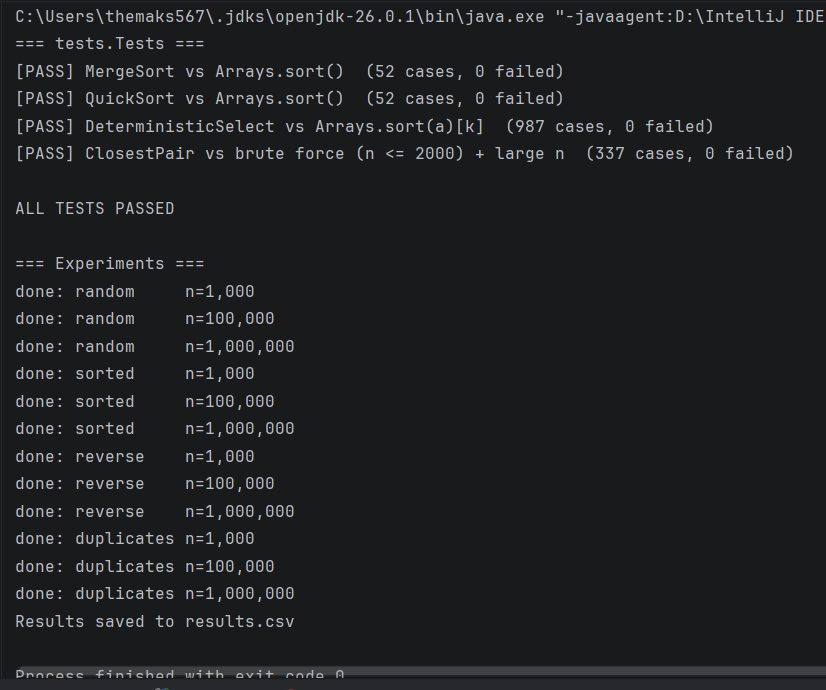
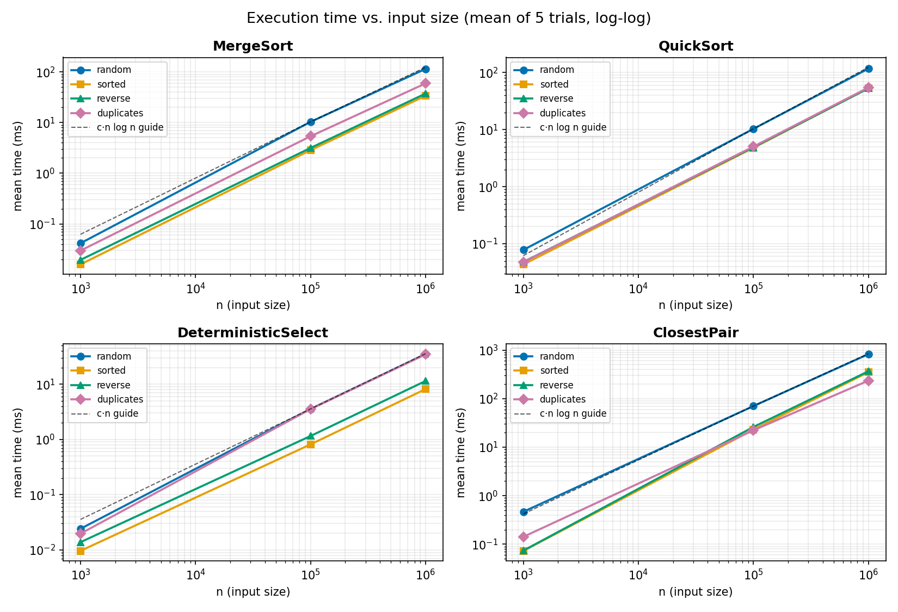
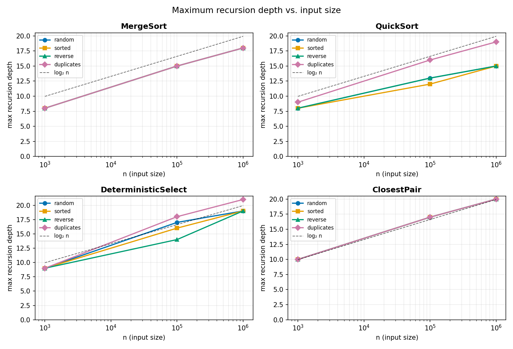

# Sorting, Selection and Closest Pair: Implementation and Experiments

## A. Project Overview

**Purpose.** Write four "divide and conquer" algorithms in Java, check that they give correct answers, and measure how fast they are on different inputs to see whether the results match the theory.

- **Merge Sort** – sorts numbers by splitting the list in half, sorting each half and merging them.
- **Quick Sort** – sorts numbers by picking a random "pivot" and moving smaller numbers to its left and bigger ones to its right.
- **Deterministic Select** – finds the k-th smallest number (for example the median) without sorting everything.
- **Closest Pair** – finds the two closest points among many points in the plane.

Run everything with `java -cp out Main` (tests first, then experiments, which are saved to `results.csv`). Test setup: [AMD Ryzen 7 7435HS / 16GB of RAM / OpenJDK 27 ]. Each test used 1,000, 100,000 and 1,000,000 items, four input types (random, sorted, reverse-sorted, many duplicates), and 5 timed runs after one warm-up run.

## B. Algorithm Analysis

**Merge Sort** halves the list, sorts both halves and merges them. It takes about n log n steps in every case and needs an extra array of size n. Recurrence: T(n) = 2T(n/2) + n. By the Master Theorem, there are log n levels of halving and each level does about n work, so the total is n log n.

**Quick Sort** picks a random pivot, splits the list around it, and repeats on both sides (smaller side first). It takes about n log n steps on average and only a small amount of extra memory (log n). It would only reach n² with extremely bad luck. Recurrence: T(n) = T(k) + T(n−k) + n. By the Akra–Bazzi intuition, as long as the pivot doesn't land at the very edge, the list keeps shrinking by a constant fraction, so there are still about log n levels.

**Deterministic Select** finds a *guaranteed good* pivot by splitting the list into groups of 5, taking each group's median, and then taking the median of those medians. It then continues only on the side that contains the answer. It takes about n steps in the worst case and needs an extra array of about n/5. Recurrence: T(n) ≤ T(n/5) + T(7n/10) + n. The Master Theorem doesn't fit (two different sizes), but Akra–Bazzi does: since 1/5 + 7/10 = 0.9 is less than 1, each level does less work than the one above it, so the total is only about n.

**Closest Pair** sorts the points by x, splits them in half, solves each half, and then only checks the narrow strip around the split line, because any closer pair that crosses the line must lie there. It takes about n log n steps and n extra memory. Recurrence: T(n) = 2T(n/2) + n, the same as Merge Sort. (My strip is sorted with a simple method that is slow if almost all points fall in the strip, which doesn't happen with random points.)

## C. Experimental Results

Times are averages of 5 runs, in milliseconds (all raw data is in `results.csv`). Closest Pair time includes sorting the points by x.

**Time for different sizes (random input)**

| Algorithm | n = 1,000 | n = 100,000 | n = 1,000,000 |
|---|---:|---:|---:|
| MergeSort | 0.041 | 10.4 | 116 |
| QuickSort | 0.078 | 10.3 | 117 |
| DeterministicSelect | 0.024 | 3.57 | 35.2 |
| ClosestPair | 0.467 | 70.2 | 826 |

**Time for different input types (n = 1,000,000)**

| Algorithm | random | sorted | reverse | duplicates |
|---|---:|---:|---:|---:|
| MergeSort | 116 | 34.0 | 37.6 | 59.8 |
| QuickSort | 117 | 53.0 | 53.0 | 54.6 |
| DeterministicSelect | 35.2 | 8.16 | 11.4 | 34.7 |
| ClosestPair | 826 | 351 | 366 | 235 |

**Deepest recursion**

| Algorithm | n = 1,000 | n = 100,000 | n = 1,000,000 |
|---|---:|---:|---:|
| MergeSort | 8 | 15 | 18 |
| QuickSort | 8–9 | 12–16 | 15–19 |
| DeterministicSelect | 9 | 14–18 | 19–21 |
| ClosestPair | 10 | 17 | 20 |
| *log₂ n (for reference)* | 10 | 17 | 20 |

**Extra metric (recursive calls) at n = 1,000,000:** Quick Sort made exactly 1,000,000 calls, Merge Sort 262,143, Closest Pair 1,048,575, and Deterministic Select only about 9,000–11,000 because it follows just one side each time.

## D. Discussion

**Do the results match the theory?** Yes. Making the input 10× bigger (100,000 → 1,000,000) made Merge Sort, Quick Sort and Closest Pair about 11–12× slower, which is what n log n predicts (about 12×), and made Deterministic Select about 10× slower, which is what a linear algorithm predicts. Depths were close to log₂ n. Results for n = 1,000 were noisy because those runs take well under a millisecond.

**How does the input affect performance?** None of the algorithms got slow on sorted, reverse-sorted or duplicate-heavy data. Ordered data was even *faster* (Quick Sort 53.0 ms vs 117 ms, Select 8.16 ms vs 35.2 ms), probably because the CPU predicts regular patterns well. Closest Pair changed most (826 ms random vs 351 ms sorted), probably because sorting already-sorted points is very cheap.

**Why does recursing on the smaller part first help Quick Sort?** Each recursive call then gets at most half of the items, so the depth can never exceed about log₂ n (about 20 for a million items), even with unlucky pivots. That avoids running out of stack memory and does not change the speed.

**Why does Median-of-Medians guarantee O(n)?** The chosen pivot always has about 30 % or more of the items on each side, so the remaining problem is at most 70 % of the size. Finding that pivot costs only a smaller problem of size n/5, and 1/5 + 7/10 is less than 1, so the total work shrinks at every level and adds up to a constant times n.

**Why is Closest Pair faster than O(n²)?** Brute force checks every pair, which is about 500 billion checks for a million points and would take minutes (my estimate). The divide-and-conquer version only compares points that are close to the dividing line and to each other, so the combine step is linear. It took about 0.8 seconds.

**What practical factors matter?** Java's warm-up (JIT), garbage collection (Select and Closest Pair create many temporary arrays), the CPU cache (arrays of numbers are cache-friendly, but many separate `Point` objects are not), and other programs running on the computer. Some of these explanations are educated guesses, not measured.

## E. Reflection

I learned that theory really does show up in measurements: 10× more data took about 11–12× longer for the n log n algorithms and about 10× longer for the linear one. I also saw that the "big-O" class is not everything, because data order, memory layout and the JVM changed the speed by up to 4× without changing the complexity.

The hardest part was edge cases. My first Deterministic Select gave wrong answers because the pivot was never put in the position my partition expected, and duplicate values made Quick Sort and Select extremely slow until I switched to a partition method that handles equal values. I also learned that Closest Pair needs its points sorted by x first, and that good tests (comparing with `Arrays.sort()` and brute force) are needed before trusting any timing.

## F. Screenshots

**Program output:** 

**Plots:**

